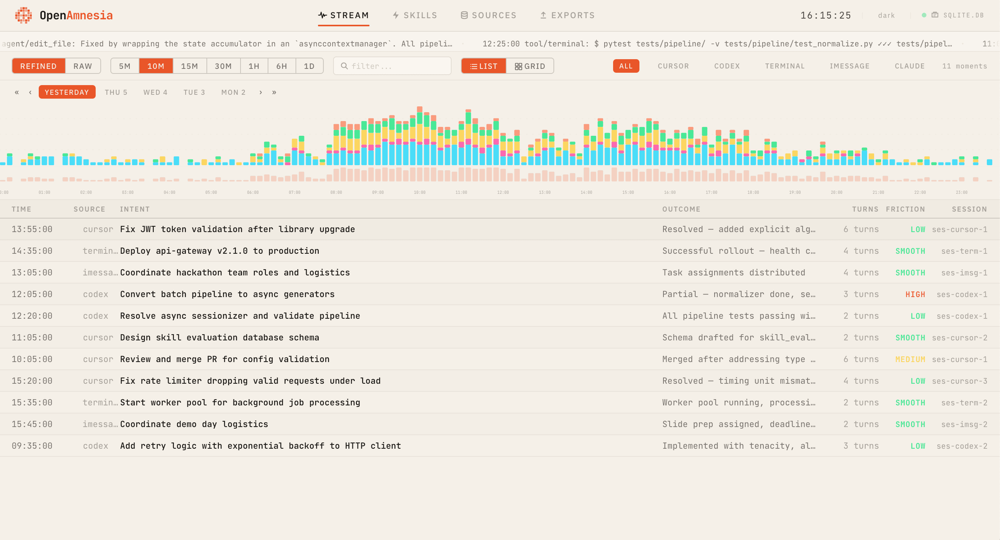

<h1 align="center">Open Amnesia</h1>

<p align="center">
  <strong>Local-first memory for agents. From raw traces to reliable context.</strong>
</p>

<p align="center">
  
</p>

<p align="center">
  A continual learning context engine that turns messy session logs into structured moments, facts, and skills.
</p>

## Inspiration
Agents are only as good as their context—but most context lives in scattered traces: coding agent sessions, IDE chats, tool calls, and personal messages. We wanted a continual learning context engine that can securely extract memory from real activity, so agents can cold-start with high-signal history and stay current as your projects evolve.

Open Amnesia is our answer: a local-first “memory stream” that turns messy session logs into structured moments, facts, and skills—automatically.

## What it does
Open Amnesia ingests multi-source logs (Codex, Claude, iMessage) and transforms them into a structured memory layer:

- Normalizes heterogeneous session formats into a single event schema
- Segments activity into “moments” (intent → actions/tool calls → outcomes → artifacts)
- Clusters + summarizes sessions into high-signal timelines (per day/week/month)
- Extracts candidates for:
  - Facts (stable context: projects, decisions, people, configs)
  - Skills (repeatable workflows: triggers, steps, checks)
- Exports:
  - Date-based memory files (`YYYY_MM_DD.md`) for PKM/agents
  - JSON + HTTP endpoints so any agent/runtime can fetch context on demand

Result: a privacy-preserving cold start + continual update pipeline for personal and project agents.

## How we built it
We built a local-first pipeline designed for determinism and reprocessing:

1. Connectors ingest logs from different sources (Codex, Claude, iMessage)
2. Filters + redaction clean and scope data (time ranges, project tags, secret/PII patterns)
3. Normalization converts everything into a stable Event IR (turn-by-turn with tool call/result structure)
4. Sessionization + clustering group events into coherent moments and threads
5. Enrichment (LLM-assisted summaries + extraction) runs only after deterministic preprocessing
6. Storage lands in SQLite as the system-of-record
7. Serving layer exposes read-only context via a FastAPI API
8. UI (React) provides inspection, filtering, and export controls

Memory is exported daily/weekly/monthly in consistent templates so downstream agents can reliably consume it.

## Challenges we ran into
- Schema normalization: each source logs “turns” differently (tool calls, metadata, timestamps, nesting)
- Deterministic grouping: making time/project filters behave consistently across connectors
- LLM noise + token budgets: enrichment is expensive and can amplify messy clusters if run too early
- Deduplication: avoiding repeated banners, retries, and tool spam creating low-quality memories
- Privacy constraints: extracting value while respecting local-first + redaction requirements

## Accomplishments that we're proud of
- End-to-end ingestion from three real sources (Codex, Claude, iMessage)
- Stable Event IR → Moment → Memory pipeline with reproducible outputs
- Date-based memory exports plus a clean read-only API for agent consumption
- Tool call/result extraction that preserves evidence and artifacts (diffs, commands, links)
- Practical filtering: by time window and “project group” for multi-project workflows

## What we learned
Data consistency beats prompt cleverness. The quality of agent memory depends on stable, deterministic preprocessing—normalization, filtering, and deduplication—before any LLM step. Once the “shape” of the data is reliable, extraction and summarization become dramatically better and cheaper.

## What's next for Open Amnesia
- Continual learning loops: friction signals → skill patches → eval → promote
- Per-project memory streams and timeline playback UI
- Skill Gym: auto-generate and manage skills as versioned artifacts (triggers/steps/checks/metrics)
- Sponsor integrations as modules:
  - You.com for grounded enrichment and fresh context
  - Composio for actions (create issues, post summaries, update docs)
  - A third integration for deployment/compute/voice, depending on workflow
- Local watchers + LaunchAgent for real-time ingestion (opt-in), plus stronger redaction policies

## Tech stack
- Languages: Python, TypeScript
- Backend: FastAPI, SQLite
- Frontend: React, Vite, Tailwind CSS, React Router, TanStack Query
- LLM/Enrichment: LiteLLM (OpenAI models), You.com APIs, Composio
- Deployment: Render, Akash
- Tooling: ruff, mypy, pytest, pre-commit

## Quick start
```bash
python -m venv .venv
source .venv/bin/activate
pip install -e .
```

Run the interactive SDK menu:
```bash
amnesia
```

End-to-end demo (ingest + discovery for all enabled sources):
```bash
make e2e-all
```

Run API/UI:
```bash
make api
make ui
```

Deploy:
```bash
make deploy-render
make deploy-akash
```

## Commands
```bash
amnesia                      # Interactive SDK menu
make e2e-all                 # Full ingest + discovery (recent window)
make e2e-all MODE=all         # Full ingest + discovery (all time)
python scripts/run_ingest.py --config config.yaml
python scripts/run_discovery.py --source codex --limit 500
```

## API
Read-only memory endpoints:
- `/api/memory/daily?date=YYYY-MM-DD`
- `/api/memory/daily/latest`
- `/api/memory/daily/range?start=YYYY-MM-DD&end=YYYY-MM-DD`

## Deployment
Render:
- Set `RENDER_API_KEY` and `RENDER_SERVICE_ID`
- Run: `make deploy-render`

Akash:
- Build/push image to GHCR (CI does this automatically for Akash deploys)
- Set `AKASH_WALLET`, `AKASH_KEY_NAME`, `AKASH_KEYRING_BACKEND`, `AKASH_NET`
- Optional: `AKASH_IMAGE` (defaults to GHCR)
- Run: `make deploy-akash`

CI/CD:
- Manual deploy workflow: `.github/workflows/deploy.yml`
- Choose target `render` or `akash`

## Config
```yaml
store:
  backend: sqlite
  dsn: sqlite:///./data/amnesia.db

exports:
  enabled: true
  memory:
    enabled: true
    mode: openclawd
    output_dir: ./exports/memory
    formats: ["md"]
    daily: true
    weekly: true
    monthly: true
    per_project: true

e2e:
  mode: recent
  since_days: 30
  discovery_limit: 500
  log_level: INFO
```

## Filters
Universal filter dimensions:
- content: `include_contains` / `exclude_contains`
- group: `include_groups` / `exclude_groups`
- actor: `include_actors` / `exclude_actors`
- time window: `since_ts` / `until_ts` (ISO-8601)

Example:
```yaml
sources:
  - name: codex
    enabled: true
    path: ~/.codex
    pattern: "*.jsonl"
    include_groups: ["opik-main"]
    since_ts: "2026-02-01T00:00:00Z"
```
